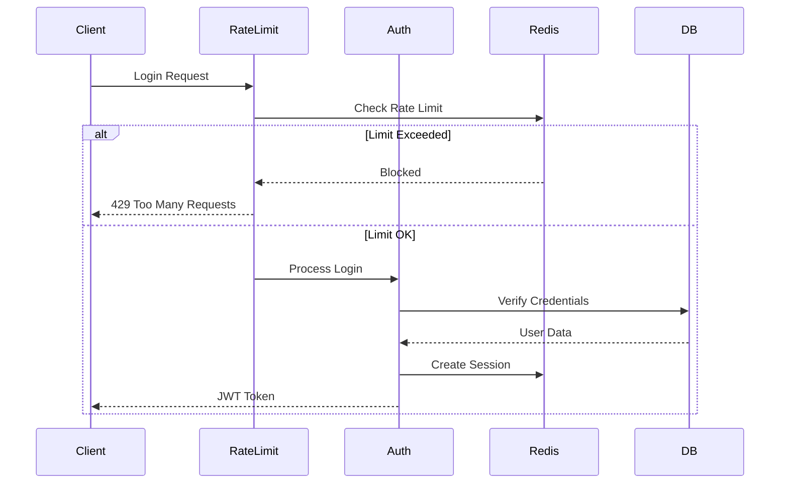

# Technical Specification

## System Architecture

### Core Components

#### 1. Authentication System
- JWT-based authentication
- Redis-backed rate limiting
  - Login: 5 attempts/5min, 15min block
  - Registration: 3 attempts/hour, 2hr block
- IP-based blocking for security
- Secure password hashing with bcrypt
- Session management with Redis

#### 2. Task Processing System
- Priority-based task queue
- Concurrent execution management
- Progress tracking
- Error recovery with retries
- Dead letter queue for failed tasks
- Task persistence in PostgreSQL

#### 3. Monitoring Infrastructure
- System metrics collection
- Performance monitoring
- Error tracking
- Datadog integration
- Health check endpoints
- Metric batching and deduplication

#### 4. Data Storage
- PostgreSQL for persistent data
- Redis for caching and rate limiting
- Transaction support
- Connection pooling
- Data migrations

### Security Architecture

#### Authentication Flow


#### Rate Limiting Implementation
```typescript
interface RateLimitOptions {
  points: number;        // Number of attempts allowed
  duration: number;      // Time window in seconds
  blockDuration: number; // Block duration in seconds
  keyPrefix: string;     // Redis key prefix
}

class RateLimiter {
  constructor(
    private redis: RedisClientType,
    private monitoring: MonitoringService,
    private options: RateLimitOptions
  ) {}

  async checkLimit(ip: string): Promise<boolean> {
    const key = `${this.options.keyPrefix}:${ip}`;
    const attempts = await this.redis.incr(key);
    
    if (attempts === 1) {
      await this.redis.expire(key, this.options.duration);
    }

    if (attempts > this.options.points) {
      await this.redis.expire(key, this.options.blockDuration);
      this.monitoring.increment('rate_limit.blocked', { ip });
      return false;
    }

    return true;
  }
}
```

### Monitoring Architecture

#### Metric Collection
```typescript
interface MetricOptions {
  tags?: Record<string, string>;
  timestamp?: number;
  interval?: number;
}

class MonitoringService {
  private metrics: Map<string, MetricValue[]>;
  private flushInterval: NodeJS.Timer;

  constructor(options: {
    provider: 'datadog' | 'console';
    flushIntervalMs?: number;
    batchSize?: number;
    deduplicate?: boolean;
  }) {
    // Initialize monitoring
  }

  public increment(metric: string, options?: MetricOptions): void;
  public gauge(metric: string, value: number, options?: MetricOptions): void;
  public histogram(metric: string, value: number, options?: MetricOptions): void;
}
```

#### Health Checks
```typescript
interface HealthStatus {
  status: 'healthy' | 'degraded' | 'unhealthy';
  checks: {
    redis: boolean;
    database: boolean;
    monitoring: boolean;
  };
  metrics: {
    uptime: number;
    memoryUsage: number;
    activeConnections: number;
  };
}
```

### Error Handling

#### Error Types
```typescript
enum ErrorCode {
  RATE_LIMITED = 'rate_limited',
  UNAUTHORIZED = 'unauthorized',
  INVALID_INPUT = 'invalid_input',
  INTERNAL_ERROR = 'internal_error',
  SERVICE_UNAVAILABLE = 'service_unavailable'
}

interface ErrorResponse {
  code: ErrorCode;
  message: string;
  details?: Record<string, any>;
  retryAfter?: number;
}
```

#### Recovery Strategies
1. Rate Limiting
   - Exponential backoff
   - Clear block after duration
   - Monitoring alerts

2. Service Failures
   - Circuit breaker pattern
   - Fallback mechanisms
   - Graceful degradation

### Performance Considerations

#### Optimization Strategies
1. Redis Operations
   - Connection pooling
   - Pipeline commands
   - Key expiration

2. Monitoring
   - Metric batching
   - Deduplication
   - Async flush

3. Authentication
   - Cache JWT verification
   - Distributed rate limiting
   - IP blocking cache

### Development Guidelines

#### Code Structure
```
src/
├── middleware/
│   ├── rate-limit.ts
│   ├── auth.ts
│   └── monitoring.ts
├── monitoring/
│   ├── service.ts
│   └── providers/
│       └── datadog.ts
├── routes/
│   └── auth.ts
└── utils/
    ├── redis.ts
    └── errors.ts
```

#### Testing Strategy
1. Unit Tests
   - Middleware functions
   - Service methods
   - Utility functions

2. Integration Tests
   - Rate limiting behavior
   - Authentication flow
   - Monitoring integration

3. Load Tests
   - Concurrent requests
   - Rate limit effectiveness
   - System performance

### Deployment Architecture

#### Environment Configuration
```bash
# Required
REDIS_URL=redis://localhost:6379
DATADOG_API_KEY=your_api_key
JWT_SECRET=your_secret

# Optional
METRICS_FLUSH_INTERVAL=10000
METRICS_BATCH_SIZE=50
RATE_LIMIT_POINTS=5
RATE_LIMIT_DURATION=300
```

#### Health Monitoring
1. System Metrics
   - CPU usage
   - Memory usage
   - Event loop lag
   - Active handles

2. Application Metrics
   - Request rate
   - Error rate
   - Response time
   - Rate limit events

### Future Considerations

1. Security Enhancements
   - OAuth integration
   - 2FA support
   - API key management
   - Audit logging

2. Performance Improvements
   - Redis cluster
   - Metric aggregation
   - Request batching
   - Cache optimization

3. Monitoring Upgrades
   - Custom dashboards
   - Alert configuration
   - Log aggregation
   - Trace sampling 